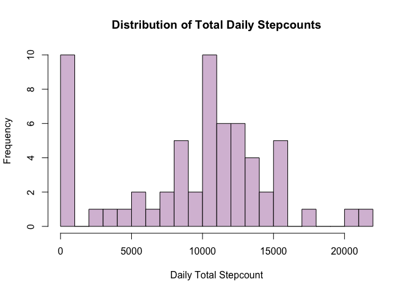
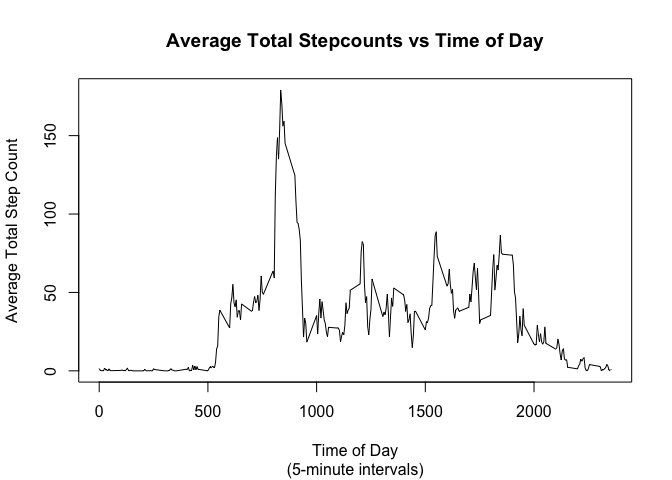
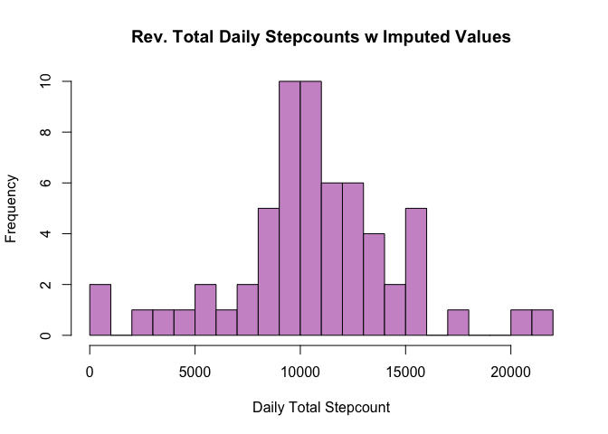
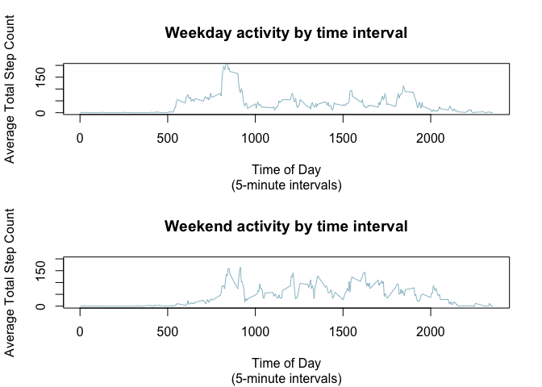

```
## ── Attaching packages ────────────────────────────────────────────────────── tidyverse 1.2.1 ──
```

```
## ✔ ggplot2 3.1.0     ✔ purrr   0.3.0
## ✔ tibble  2.0.1     ✔ dplyr   0.7.8
## ✔ tidyr   0.8.2     ✔ stringr 1.3.1
## ✔ readr   1.3.1     ✔ forcats 0.3.0
```

```
## ── Conflicts ───────────────────────────────────────────────────────── tidyverse_conflicts() ──
## ✖ dplyr::filter() masks stats::filter()
## ✖ dplyr::lag()    masks stats::lag()
```

```
## 
## Attaching package: 'data.table'
```

```
## The following objects are masked from 'package:dplyr':
## 
##     between, first, last
```

```
## The following object is masked from 'package:purrr':
## 
##     transpose
```

## Loading, preprocessing, and first looks at the data

Let's take some basic looks at the data. First, in summary form:

```r
df <- read.csv('activity.csv',na.strings = c('','NA','NULL'))
df$date <- as.Date(df$date)## format as date

summary(df)
```

```
##      steps             date               interval     
##  Min.   :  0.00   Min.   :2012-10-01   Min.   :   0.0  
##  1st Qu.:  0.00   1st Qu.:2012-10-16   1st Qu.: 588.8  
##  Median :  0.00   Median :2012-10-31   Median :1177.5  
##  Mean   : 37.38   Mean   :2012-10-31   Mean   :1177.5  
##  3rd Qu.: 12.00   3rd Qu.:2012-11-15   3rd Qu.:1766.2  
##  Max.   :806.00   Max.   :2012-11-30   Max.   :2355.0  
##  NA's   :2304
```

## Mean total number of steps per day

We now take a peek at the distribution of the data based on total steps taken per day:

```r
total_daily_steps <- df %>%
      group_by(date) %>%
      summarise(Stepcount = sum(steps, na.rm = TRUE))
summary(total_daily_steps)
```

```
##       date              Stepcount    
##  Min.   :2012-10-01   Min.   :    0  
##  1st Qu.:2012-10-16   1st Qu.: 6778  
##  Median :2012-10-31   Median :10395  
##  Mean   :2012-10-31   Mean   : 9354  
##  3rd Qu.:2012-11-15   3rd Qu.:12811  
##  Max.   :2012-11-30   Max.   :21194
```

```r
meanDailySteps <- as.integer(mean(total_daily_steps$Stepcount,na.rm = TRUE))
medianDailySteps <- as.integer(median(total_daily_steps$Stepcount, na.rm = TRUE))

hist(total_daily_steps$Stepcount,main = 'Distribution of Total Daily Stepcounts',
     xlab = 'Daily Total Stepcount',
     ylab = 'Frequency',
     col = 'thistle',
     breaks = 22
     )
```

<!-- -->

It appears that the highest frequencies occur where participants either took < 1000
steps, or between 10,000 and 11,000 steps.

- Mean daily steps: 9354
- Median daily steps: 10395


## Average daily activity pattern

Now let's take a look at patterns of activity throughout the 24-hour day:

```
##     interval        Stepcount     
##  Min.   :   0.0   Min.   :  0.00  
##  1st Qu.: 588.8   1st Qu.:  2.16  
##  Median :1177.5   Median : 29.64  
##  Mean   :1177.5   Mean   : 32.48  
##  3rd Qu.:1766.2   3rd Qu.: 45.91  
##  Max.   :2355.0   Max.   :179.13
```

<!-- -->


The 5-minute interval with the maximum average stepcount is 835 to 840, with an average of 179.1311475 steps.


## Impute missing values


The total number of missing values in the dataset is 2304.

We will backfill the missing values with the mean for the 5-minute interval.


```r
df_backfill <- df %>%
      left_join(ts_data, by = "interval") %>%
      mutate(Imputed_5min_Stepcount = ifelse(is.na(steps),Stepcount,steps)) %>%
      select(date,interval,Imputed_5min_Stepcount) 
summary(df_backfill)
```

```
##       date               interval      Imputed_5min_Stepcount
##  Min.   :2012-10-01   Min.   :   0.0   Min.   :  0.00        
##  1st Qu.:2012-10-16   1st Qu.: 588.8   1st Qu.:  0.00        
##  Median :2012-10-31   Median :1177.5   Median :  0.00        
##  Mean   :2012-10-31   Mean   :1177.5   Mean   : 36.74        
##  3rd Qu.:2012-11-15   3rd Qu.:1766.2   3rd Qu.: 26.00        
##  Max.   :2012-11-30   Max.   :2355.0   Max.   :806.00
```

Let's look at the new distribution using the imputed values and recalculating the daily aggregated stepcount:

```
##       date            Rev_Daily_Stepcount
##  Min.   :2012-10-01   Min.   :   41      
##  1st Qu.:2012-10-16   1st Qu.: 9354      
##  Median :2012-10-31   Median :10395      
##  Mean   :2012-10-31   Mean   :10581      
##  3rd Qu.:2012-11-15   3rd Qu.:12811      
##  Max.   :2012-11-30   Max.   :21194
```

<!-- -->

The median total daily steps remains 10,395 while mean daily steps has increased from 9,354 to 10,581 steps with the use of imputed values. This makes sense because the median value is still the middle value of the 17,568 rows, however the mean would change due to the replacement of individual NAs with imputed values. The use of the imputed values resulted in an increase in the mean daily stepcount.

As an illustration of the effect of the use of imputed values to replace only the NAs and not the zero values (I assumed that zero meant that there was truly no activity), we can take a look at a date like 10-1-2012. 10-1-2012 had all NAs, thus its revised step count becamse 9,354 whereas 10-2-2012 had mostly zero steps, thus its daily total remains 126:

#### Without imputed values:

```r
head(total_daily_steps,2)
```

```
## # A tibble: 2 x 2
##   date       Stepcount
##   <date>         <int>
## 1 2012-10-01         0
## 2 2012-10-02       126
```

#### With imputed values:

```r
head(total_daily_steps_rev,2)
```

```
## # A tibble: 2 x 2
##   date       Rev_Daily_Stepcount
##   <date>                   <dbl>
## 1 2012-10-01               9354.
## 2 2012-10-02                126
```


## Impact of weekday vs weekend in exercise activity

Now we look at the difference in stepcount based on weekend vs during the week. 

```r
df_backfill = df_backfill %>%
      mutate(Weekday = weekdays(date)) %>%
      mutate(DayType = ifelse(Weekday %in% c('Monday','Tuesday','Wednesday','Thursday','Friday'),
                              'Weekday','Weekend')) 
df_dayofweek <- df_backfill %>%
      select(DayType,interval,Imputed_5min_Stepcount) %>%
      group_by(DayType,interval) %>%
      summarise(AvgSteps = mean(Imputed_5min_Stepcount))
df_weekdays <- df_dayofweek %>%
      filter(DayType == 'Weekday')
df_weekends <- df_dayofweek %>%
      filter(DayType == 'Weekend')
```

Here's how the data would plot, contrasting weekdays from weekends. 

<!-- -->

So it appears that more people get started earlier in the morning during the week (makes sense), but generally there is a higher and more even distribution of activity throughout the day, with more people being active past 8PM on weekends than during the week. It's also noteworthy that the maximum stepcount is on the weekdays. It appears that people are more intense about their exercise on weekday mornings (if they do exercise), but overall tend to get more steps on the weekend albeit in a less intensive way. Seems to make sense to me.


